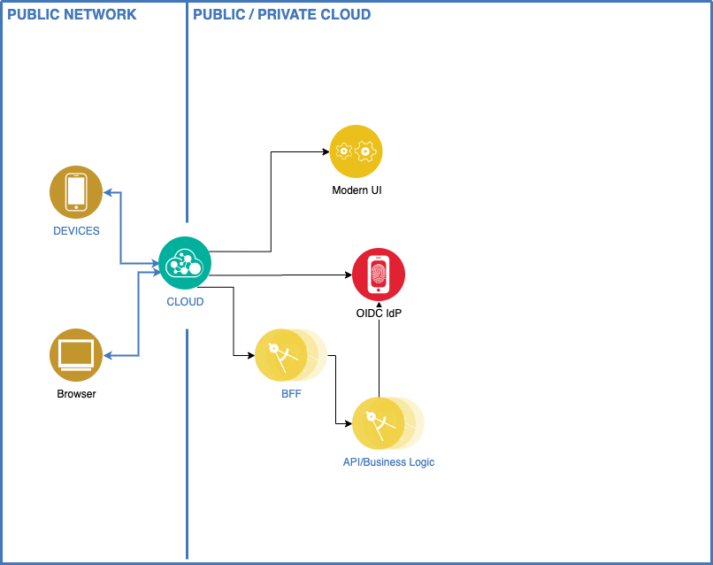

# Cloud-Friendly App Security Exercise

This exercise explores modern user and microservice security. Specifically, this exercise enables the following:

* A web app that provides the user interface through the web browser and leverages externalize Authentication services based on [IBM Cloud App ID](https://cloud.ibm.com/catalog/services/app-id) OpenID Connect (OIDC) services. Specifically, the web app leverages the OIDC Authorization Grant Type.
* A Java microservice that implements the Backend-for-frontend (BFF) pattern. The BFF and OIDC integration are implemented by using the Spring Boot Framework and Spring Security related frameworks. This microservice is packaged as a container leveraging [Eclipse JKube](https://www.eclipse.org/jkube/) automatic source-to-image and deployed to a Red Hat OpenShift CodeReady Container.
* The Java Resource microservices returns a simple message. The microservice is implemented by using the Spring Boot Framework and Spring Security related frameworks. This microservice is packaged as a container leveraging [Eclipse JKube](https://www.eclipse.org/jkube/) automatic source-to-image and deployed to a Red Hat OpenShift CodeReady Container.
* The microservice-to-microservice security between the BFF and Resource microservice leverages the OIDC JSON Web Tokens (JWT) and the Java Web KeySet (JWKS) Public Keys.


*NOTE:* The monolith application is based on the [Spring Security and Angular Tutorial](https://spring.io/guides/tutorials/spring-security-and-angular-js/).


Cloud Friendly capabilities supported by this exercise:

| Capabilities                               | Supported |
| ------------------------------------------ |:---------:|
| No Permanent disk access                   | Yes       |
| Self-contained application                 | Yes       |
| Platform-managed ports and networking      | Yes       |
| Consumes platform-managed backing services | Yes       |
| 12 Factor App methodology                  | Yes       |
| Horizonal scalable                         | Yes       |
| Leverages platform for high availability   | Yes       |
--------------------------------------------------------------

Technology Stack
* Spring Boot (v2.1.8) with embedded Tomcat
* NodeJS
* Angular 8.2.x
* OpenShift CodeReadyContainer
* [IBM Cloud App ID](https://cloud.ibm.com/catalog/services/app-id)
* [NodeShift](https://nodeshift.dev/nodeshift/)
* [Jkube](https://www.eclipse.org/jkube/)

We'll explore turning the application into a cloud friendly solution by breaking up the `legacy-ui` app, introducing the backend-for-frontend pattern, leveraging an external authentication service and introducing microservice security.



## Table of Contents

* [Pre-reqs](#pre-reqs)

  * [Basic - Run Locally Pre-reqs](#basic-run-locally-pre-reqs)
  * [Advance - Run on OpenShift Pre-reqs](#advance-run-on-openshift-pre-reqs)
* [Part 1: Running local](#part-1-running-locally)
* [Part 2: Run on Local OpenShift](#part-2-run-on-local-openshift)

## Pre-reqs

### Basic - Run Locally Pre-reqs

#### A. Git Command Line Tools

1. **Optional:** If you do not have Git client installed, go to the [Git client downloads](https://git-scm.com/downloads) website to download and install the Git client.

    **NOTE (Windows Users):** During install, on the `Choosing HTTPS transport backend` step, select `Use the native Windows Secure Channel library`.

#### B. (Optional - Windows) Java Development Kit installation

1. Verify Java Installation with the following command:

    ```sh
    java -fullversion
    ```

1. **Optional:** If you do not have Java installed, go to the [Java SE Development Kit 8 Downloads](https://www.oracle.com/technetwork/java/javase/downloads/jdk8-downloads-2133151.html) website to download and install Java.

     **NOTE:** During installation, change installation to **c:\\** ( e.g. C:\jdk1.8.0_251 )

1. Add `JAVA_HOME` system environment variable that point to your base java folder path (e.g., C:\jdk1.8.0_251 )

#### C. (Optional) NodeJS Installation

1. Verify NodeJS Installation with the following command:

    ```sh
    npm -version
    ```

    **Optional:** If you do not have NodeJS installed, go to the [NodeJS](https://nodejs.org/en/) website to download and install NodeJS.

#### D. (Optional) Visual Studio Code

1. **Optional** If you do not have Visual Studio Code installed, go to the [Visual Studio Code Download](https://code.visualstudio.com/download) website to download and install the Visual Studio Code.

1. Install Visual Studio Code Extensions:

    * [Java Extension Pack](https://marketplace.visualstudio.com/items?itemName=vscjava.vscode-java-pack)
    * [Spring Boot Extension Pack](https://marketplace.visualstudio.com/items?itemName=Pivotal.vscode-boot-dev-pack)
    * [vscode-lombok](https://marketplace.visualstudio.com/items?itemName=GabrielBB.vscode-lombok)

#### E. IBM App ID

1. You must have an IBM Cloud account. If you don't have one, [sign up for a trial](https://cloud.ibm.com/registration). The account requires an `IBMid`. If you don't have an `IBMid`, you can create one when you register.

1. Setup `App ID`, the IBM OpenID Connect (OIDC) service
    1. Create `App ID`
        1. Open Browser to [Create AppID](https://cloud.ibm.com/catalog/services/app-id)
        1. Under `Select a region`, confirm or select `Dallas` and click the `Create` button

    1. Setup `Cloud Identity Provider`
        1. Within App ID page, click `Manage Authentication` and perform the following:

            1. `Disable` the following Identity Providers: `Facebook, Google, Anonymous`

            1. Confirm the following is `enabled`: `Cloud Directory`

    1. Add `web redirect URLs`
        1. Within App ID page, click `Manage Authentication` -> `Authentication Settings`. Under `Add web redirect URLs`, add the following URLs:

            1. Add `http://localhost:8080/login` and click the `Plus` button

            1. Add `http://modern-bff-cloudfriendly-security.apps-crc.testing/login` and click the `Plus` button

    1. Setup `Cloud Directory`:

        1. Within App ID page, click `Cloud Directory` -> `Settings`. Under `Allow users to sign-up and sign-in using:` select `Username and password`

        1. Within App ID page, click `Cloud Directory` -> `Users`. Click `Create User`, complete form and click `Save`

            **IMPORTANT:** Note `username` and `password` for later use

    1. Add OIDC client app
        1. Within the App ID page, click `Applications`  and click `App Application`.
        1. Enter and select the following:
            Name: `gm4cappmod-app`
            Type: `Regular web application`
        1. Click `Save`
        1. Expand `gm4cappmod-app` and note the following for later use
            * `clientId`
            * `secret`
            * `oAuthServerUrl`

#### F. Clone cloudfriendly-app-security

1. Clone **cloudfriendly-app-security.git** GIT repo

    ```sh
    git clone https://us-south.git.cloud.ibm.com/gm4c-mod/cloudfriendly-app-security.git
    cd cloudfriendly-app-security
    ```

### Advance - Run on OpenShift Pre-Reqs

#### G. Red Hat CodeReady Container

1. [Install on Laptop: Red Hat CodeReady Containers](https://cloud.redhat.com/openshift/install/crc/installer-provisioned)

    **NOTES:**

    a. Requires Red Hat Developer credentials, which gives you access to developer tools and programs via [Red Hat Developer](https://developers.redhat.com). To sign-up, click the `Log In` link on the top right of the page and then click the `Create one now` link.

    b. Perform [Chapter 2. Installation](https://access.redhat.com/documentation/en-us/red_hat_codeready_containers/1.8/html-single/getting_started_guide/index#installation_gsg)

    c. (Optional - Windows) On windows, you will need to reboot after `crc setup` if you have not enabled Hyper-V before. Reboot is required to enable the Hyper-V feature.

    d. (Optional - Windows) On windows, if `crc start` fails, perform `crc delete`, `rmdir .crc` then `crc setup` and `crc start`.

    e. (Optional - Windows) On windows, if you observe ` error pinging docker registry quay.io` error within OpenShift events, perform `crc stop`, then `crc start -n 1.1.1.1`

1. Confirm OpenShift CRC `running` on the local machine:

    ```sh
    crc status
    ```

## Part 1: Running locally

1. Open `cloudfriendly-app-security` inside Visual Studio Code

     1. Open Visual Studio Code
     1. File->Open Workspace... -> cloudfriendly-app-security.code-workspace

1. Open `.vscode/launch.json` and replace `REPLACE_WITH_CLIENT_ID`, `REPLACE_WITH__SECRET`, and `REPLACE_WITH_OAUTH_SERVER_URL` with registered `App ID` app info:

    1. Replace `REPLACE_WITH_CLIENT_ID` with `clientId` data saved from IBM App ID, Pre-reqs step 4.

    1. Replace `REPLACE_WITH_SECRET` with `secret` data saved from IBM App ID, Pre-reqs step 4.

    1. Replace `REPLACE_WITH_OAUTH_SERVER_URL` with `oAuthServerUrl` data saved from IBM App ID, Pre-reqs step 4.

        **NOTE:** Two locations in .vscode/launch.json file

1. Run **resource-ms** locally. Within Visual Studio Code:
    1. Expand **SPRING-BOOT DASHBOARD**, click the refresh icon, right mouse click on **resource-ms** and click **Start**

1. Run **modern-bff** locally. Within Visual Studio Code:
    1. Expand **SPRING-BOOT DASHBOARD**, click the refresh icon, right mouse click on **modern-bff** and click **Start**

1. Run **modern-ui** locally. Within Visual Studio Code:

    1. Install `modern-ui` dependent npm modules:

       1. Select `Terminal` from menu bar, then `Run Task...` and select `npm: install:all - modern-ui`

          **NOTE**: Check Terminal and enter an appropriate response to `Would you like to share anonymous usage data with the Angular Team at Google ...` question, if prompted

    1. Build `modern-ui` angular content:

       1. Select `Terminal` from the menu bar, then `Run Task...` and select `npm: build:content - modern-ui` and select `Continue without scanning the task output`

    1. Run `modern-ui` node app:

       1. Select `Terminal` from the menu bar, then `Run Task...` and select `npm: start - modern-ui` and select `Continue without scanning the task output`

1. Open browser to http://localhost:4200

1. Click **Login**, enter your username and password and click submit:

1. Click [Details](http://localhost:4200/details). You should observe ID and content information


## Part 2: Run on Local OpenShift

1. Open a Terminal or Windows `Git Bash` window, create an OpenShift project as the `developer` user

    ```sh
    eval $(crc oc-env); oc login -u developer -p developer --server=https://api.crc.testing:6443 --insecure-skip-tls-verify
    oc new-project cloudfriendly-security
    ```

1. Create OIDC `gm4cappmod-app` secret

    1. Copy template-app-id.env to gm4cappmod-app.env

    1. Edit `gm4cappmod-app.env`

        1. Replace `REPLACE_WITH_OAUTH_SERVER_URL` with `oAuthServerUrl` data saved from IBM App ID, Pre-reqs step 4.
        1. Replace `REPLACE_WITH_CLIENT_ID` with `clientId` data saved from IBM App ID, Pre-reqs step 4.
        1. Replace `REPLACE_WITH_SECRET` with `secret` data saved from IBM App ID, Pre-reqs step 4.

    1. Create gm4cappmod-app secret on OpenShift

        ```sh
        oc create secret generic gm4cappmod-app --from-env-file=gm4cappmod-app.env
        ```

1. Deploy **resource-ms** microservice application to OpenShift

    1. Build and deploy **resource-ms** microservice to OpenShift. Within the Terminal or Windows `Git Bash` window, perform the following:

        ```sh
        cd resource-ms

        # Create your OpenShift resource descriptors
        # Build component and start S2I build
        # and Deploy your microservice on Openshift cluster
        ./mvnw clean package oc:deploy -Popenshift
        ```

        **NOTE:** 
        * Ignore `ERROR`(s) denoting cannot extract Git information
        * When deploying additional code or configuration changes, perform the following after running `oc:deploy`

        ```sh
        oc rollout latest resource-ms
        ```

    1. Check the status of `resource-ms` app

        ```sh
        oc status
        ```

        **NOTE:** Might need to repeat the command until it displays `deployment #1 running`

1. Deploy **modern-bff** microservice application to OpenShift

    1. Build and deploy **modern-bff** microservice to OpenShift. Within the Terminal or Windows `Git Bash` window, perform the following:

        ```sh
        cd ../modern-bff

        # Create your OpenShift resource descriptors
        # Build component and start S2I build
        # and Deploy your microservice on Openshift cluster
        ./mvnw clean package oc:deploy -Popenshift
        ```

        **NOTE:**
        * Ignore `ERROR`(s) denoting cannot extract Git information
        * When deploying new code or configurations changes, perform the following after running `oc:deploy`

        ```sh
        oc rollout latest modern-bff
        ```

    1. Check the status of `modern-bff` app

        ```sh
        oc status
        ```

        **NOTE:** Might need to repeat the command until it displays `deployment #1 running`

1. Deploy **modern-ui** microservice UI application to OpenShift

    1. Build and deploy **modern-ui** microservice to OpenShift. Within the Terminal or Windows `Git Bash` window, perform the following:

        ```sh
        cd ../modern-ui
        npm run install:all
        npm run build:content
        npm run nodeshift
        oc expose svc/modern-ui
        ```

    1. Check the status of `modern-ui` app

        ```sh
        oc status
        ```

        **NOTE:** Might need to repeat the command until it displays `deployment #1 deployed`

1. Open browser to `modern-ui`

    1. Open browser to http://modern-ui-cloudfriendly-security.apps-crc.testing

    1. Click **Login**, enter the following and click submit:

       username: <your username>
       password: <your password>

    1. Click `Details`. You should observe ID and content information
